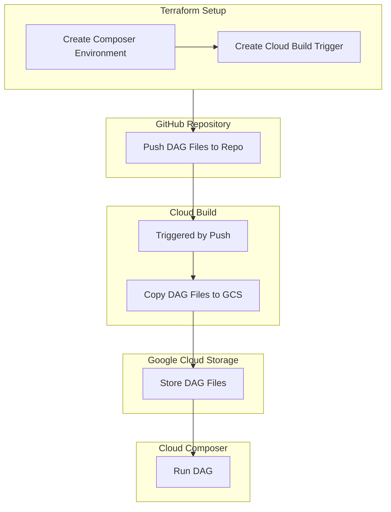

# Cloud Composer Deployment Guide using Terraform and Cloud Build
## 全体フロー
以下はCloud Composerのデプロイの全体フローです。Terraformを使った環境構築から、GitHubを使ったバージョン管理、Cloud Buildでの自動デプロイまでの流れを示します。



## 構築手順

1. Terraformを使用してCloud Composer環境を作成する

- Terraformを使って、Cloud Composer環境の構築を自動化します。

### 手順

<!-- @import "[TOC]" {cmd="toc" depthFrom=1 depthTo=6 orderedList=false} -->
    1. Terraformのセットアップ:

    - Terraformがローカルにインストールされていることを確認してください。
    - GCP認証情報を設定します。

    ```bash
    export GOOGLE_APPLICATION_CREDENTIALS="<path_to_service_account_key>"
    ```

    2. Terraform構成ファイルの作成:

    - main.tfファイルを作成し、Cloud Composer環境を定義します。

    ```hcl
    provider "google" {
    project = var.project_id
    region  = var.region
    }

    resource "google_composer_environment" "basic_composer" {
    name   = var.composer_environment_name
    region = var.region

    config {
        node_count = var.node_count
        software_config {
        image_version = var.image_version
        }
    }
    }
    ```

    3. 変数ファイルの作成:

    - variables.tfに必要な変数を定義します。
    ```hcl
    variable "project_id" {
    description = "GCP Project ID"
    type        = string
    }

    variable "region" {
    description = "GCP Region"
    type        = string
    default     = "us-central1"
    }

    variable "composer_environment_name" {
    description = "Cloud Composer Environment Name"
    type        = string
    default     = "basic-composer-env"
    }

    variable "node_count" {
    description = "Number of nodes for the Composer environment"
    type        = number
    default     = 3
    }

    variable "image_version" {
    description = "Composer image version"
    type        = string
    default     = "composer-2.0.1-airflow-2.1.0"
    }
    ```

    4. Terraformの実行:

    Terraformを初期化し、環境を作成します。
    ```bash
    terraform init
    terraform plan
    terraform apply
    ```

2. Cloud Buildトリガーの作成

- GitHubリポジトリのプッシュイベントを検知して、Cloud Buildを使用してDAGファイルをGCSにアップロードするトリガーを設定します。

### 手順
    1. Cloud Buildのトリガー設定:

    main.tfにCloud Buildトリガーの設定を追加します。
    ``` hcl
    resource "google_cloudbuild_trigger" "dag_deploy_trigger" {
    name        = "dag-deploy-trigger"
    description = "Deploy DAG files to Cloud Composer DAGs bucket"
    github {
        owner = "<github_owner>"
        name  = "<repo_name>"
        push {
        branch = "main"
        }
    }

    build {
        step {
        name = "gcr.io/cloud-builders/gsutil"
        args = ["cp", "dags/*.py", "gs://<composer-environment-name>/dags/"]
        }
    }
    }
    ```

    2. GitHubとGCPの連携:

    GitHubのリポジトリとCloud Buildの連携を設定します。
    GCPコンソールからGitHubとの統合を設定し、必要な権限を付与します。

3. GitHubへのDAGファイルのプッシュ
DAGファイルをGitHubリポジトリにプッシュすることで、Cloud Buildがトリガーされます。

### 手順

    1. DAGファイルの作成:

    DAGファイル（例：simple_dag.py）を作成します。
    ``` python
    from airflow import DAG
    from airflow.operators.python_operator import PythonOperator
    from datetime import datetime, timedelta

    default_args = {
        'owner': 'airflow',
        'depends_on_past': False,
        'start_date': datetime(2024, 10, 1),
        'email_on_failure': False,
        'retries': 1,
        'retry_delay': timedelta(minutes=5),
    }

    with DAG(
        dag_id='simple_hello_world_dag',
        default_args=default_args,
        description='A simple hello world DAG',
        schedule_interval=timedelta(days=1),
        catchup=False,
    ) as dag:

        def print_hello_world():
            print("Hello, world!")

        hello_world_task = PythonOperator(
            task_id='print_hello_world',
            python_callable=print_hello_world,
        )
    ```

    2. GitHubにプッシュ:

    作成したDAGファイルをGitHubリポジトリにプッシュします。
    ```bash
    git add dags/simple_dag.py
    git commit -m "Add simple DAG file"
    git push origin main
    ```

4. Cloud BuildによるDAGファイルのデプロイ

- GitHubにプッシュされたDAGファイルは、Cloud Buildによって自動的にGCSにデプロイされます。

### 手順

    1. Cloud Buildのトリガー確認:

    - GitHubへのプッシュ後、Cloud Buildのトリガーが作動し、DAGファイルがGCSにアップロードされます。

    2. GCSでのDAGファイルの確認:

    - GCSコンソールにアクセスし、Cloud ComposerのDAGバケットにDAGファイルがアップロードされていることを確認します。

5. Cloud ComposerでDAGの実行
アップロードされたDAGファイルは、Cloud ComposerのAirflowによって検出され、実行されます。

### 手順

    1. Airflow UIへのアクセス:

    - Cloud Composer環境のAirflow UIにアクセスします。
    - 作成したDAGが一覧に表示されていることを確認します。

    2. DAGの実行:
    - DAGを手動で実行するか、定義されたスケジュールに従って実行されるのを待ちます。


## まとめ

このガイドでは、TerraformとCloud Buildを使用してGoogle Cloud Composer環境を構築し、GitHubからのDAGファイルのデプロイと実行を自動化する手順を説明しました。この手順を使用することで、DAGのデプロイが効率的に行えるようになり、CI/CDパイプラインを容易に構築できます。

